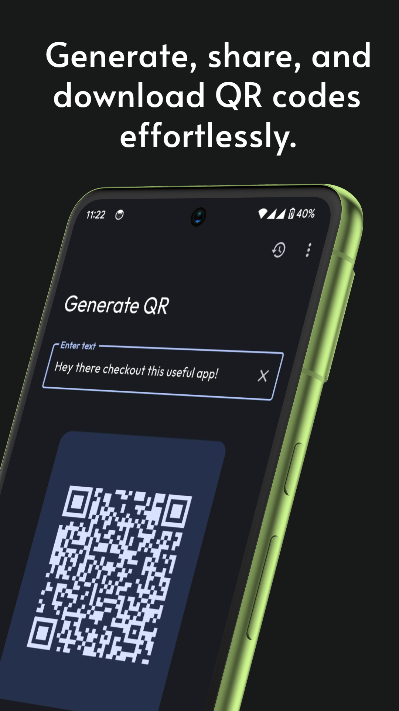
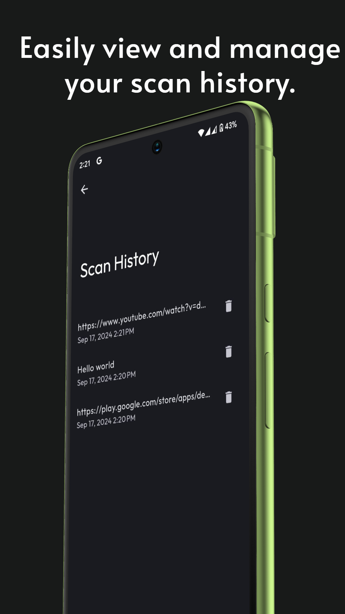
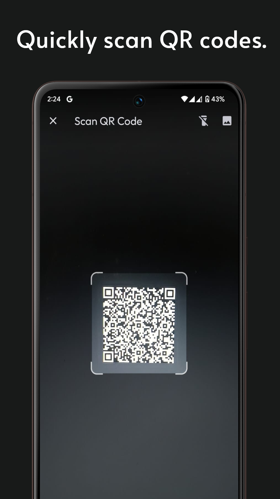

<!-- ---------- Header ---------- -->

  
  <h1>Easy QR Toolkit</h1>
  
Simple Material YOU Inspired QR Code Generator & Scanner App

<!-- ---------- Labels ---------- -->

 
  
  
  
      
        
  
  
    
  

<!-- ---------- Screenshots ---------- -->

  <h2>Screenshots</h2>
  

    
    
    
  

<!-- ---------- Features ---------- -->
## Features

- **Effortless QR Code Generation**: Instantly generate QR codes for text with just a few taps.
- **Quick QR Code Scanning**: Scan QR codes using your camera or from an image in your gallery to extract information in real-time.
- **Material You Design**: Built with the latest Material You design principles, offering a clean, modern look that adapts to your system's theme.
- **Dynamic Colors**: Enjoy personalized color schemes that match your device’s system-wide color preferences for a visually consistent experience.
- **Easy-to-Use Interface**: A straightforward, intuitive layout ensures generating and scanning QR codes is hassle-free.
- **Offline QR History**: Store scanned QR codes in your device using **sqflite** for easy access to your QR scan history, even without an internet connection.

<!-- ---------- Download ---------- -->

  <h2>Download</h2>
  

<!-- ---------- Contribution ---------- -->

  <h2>Contribution</h2>
  
Feel free to contribute to the project by creating a pull request.

